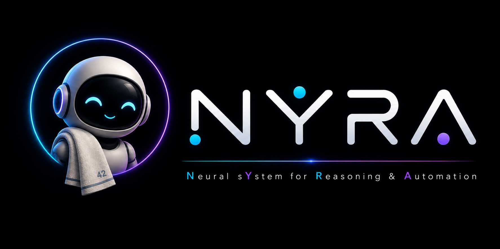

  

# N.Y.R.A.

**Neural sYstem for Reasoning & Automation**

N.Y.R.A. is an open, modular AI assistant architecture designed to combine natural interaction, intelligent reasoning, persistent memory, contextual awareness, and real-world automation.

At its core, Nyra uses a centralized Router to orchestrate specialized services for reasoning, skills, memory, voice, identity, and external capabilities while maintaining consistent context, security policies, observability, and distributed tracing across the entire request lifecycle.

Nyra is designed around a simple principle:

> Understand the user, understand the context, reason when necessary, and act deterministically whenever possible.

The project is built to be self-hosted, observable, extensible, and reproducible.

Home Assistant is the first automation platform integrated with Nyra, but the architecture is intentionally designed to remain independent from any single automation system or AI provider.

## Project status

Nyra v1 is currently under active development.

The previous implementation is considered an alpha/prototype and is used as a functional reference while the production architecture is rebuilt.

## Core principles

- Centralized orchestration through Nyra Router.
- Specialized services with clearly defined responsibilities.
- No direct communication between first-level Nyra services.
- Centralized capability authorization and policy enforcement.
- Persistent contextual and operational memory.
- Deterministic execution whenever possible.
- AI reasoning only where it provides actual value.
- Centralized structured logging and distributed tracing.
- A single administration and observability interface exposed by Router.
- Reproducible deployments.
- No hardcoded installation-specific addresses or credentials.
- Provider-independent architecture.

## Repository language

All source code, comments, documentation, configuration examples, API names, log events, and commit messages are written in English.
